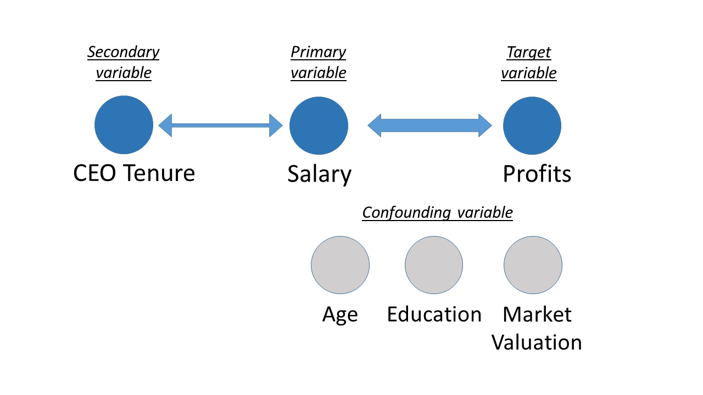

# 1. Introduction
Objective of this analysis is to produce a report on CEO salary and answer the question whether company performance is related to salary. The data was collected and provided by the think tank firm. It has 185 rows and 8 variables as following.

1. salary 1990 compensation, $1000s
2. age in years
3. college =1 if attended college
4. grad =1 if attended graduate school
5. comten years with company
6. ceoten years as ceo with company
7. profits 1990 profits, millions
8. mktval market value, end 1990, mills.

We approached this analysis by hypothesizing that "salary" is a primary (input) variable and "profits"" is the target (output) variable (the reasons for picking profits as the output are mentioned below). In order to conduct an exploratory analysis  we perform the following steps: 

* Understand all the variables
* Perform univariate analysis
* Perform bivariate analysis, including assessing impact of outliers
* Identify potential confounding variables
* Identify potential secondary variables

Based on findings through the analysis, We formed a conclusion. 

### Definition of company performance
Our first task is to define company performance. The performance of a corporate entity can be 
defined as a composite assessment of how well an organization executes on its most important parameters,
typically financial, market and shareholder performance. Key performance indicators (KPI) include 
revenue, return on investment (ROI) (or profit), overhead and operational costs.

### Variable Identification
#### Target Variable
From the provided dataset, there were two candidate target variables: "profits" or "mktval". 

Profits are generally considered to be one of metrics to represent company performance while market value is understood as shareholder's expectation for a company and is not always tied to company performance. Thus we choose profits as a proxy for company performance in this anaysis, not market value.

#### Predictor Variable
As mentioned in the objective, the predictor variable is the salary. 

# 2. Set-up and understand the data at high level

```{r setup, include=FALSE}
knitr::opts_chunk$set(echo = TRUE)
#closeAllConnections()
#rm(list=ls())

library(car)
library(ggplot2)
library(dplyr)
library(grid)
library(gridExtra)
library(tidyr)
library(reshape2)

setwd("/Users/shiny/Documents/UCB/w203/")
load("ceo_w203.RData")

# confirm CEO data is loaded
objects()
```


```{r, warning=FALSE, error=FALSE, fig.align="center", fig.width=12, fig.height=10}
nrow(CEO)
summary(CEO)
# confirmed there is no NA value in each column
```
We observed no NA's in the provided dataset. For a scatterplot, we removed college and grad data as they are in binary form.
```{r}
# removed college and grad as the data is binary, with possible values 1 or 0
scatterplotMatrix(~ salary + age + comten + ceoten + profits + mktval,
                  data = CEO, diagonal = "histogram")
```

```{r}
# get correlations 
cor(CEO %>% select(-c(college, grad)))
```

## Observations Based on Scatter Plot Matrix
* profits and mktval: strong correlation
    + We can see a strongly correlated relationship between profit and market value from the graph in position (5,6) or (6,5)
* salary and profits: mild correlation
    + We see a weaker correlation between salary and profit from the graph in position (1,5) or (5,1)
* salary and age: weak correlation 
    + We see very little correlation between salary and age based on the graphs in position (1,2) or (2,1)

# 3. Univariate Analysis --- Understand Each Variable
Our objective in performing univariate analysis was to understand the characteristics of each variable, in terms of their distribution and spread, and to determine how many outliers existed.

Univariate analysis is the simplest form of analyzing data. It doesn’t deal with causes or relationships and it’s major purpose is to describe; it takes data, summarizes that data and finds patterns in the data. 

Univariate analysis varies depending on whether the variable type is continuous or categorical. We will look at the statistical measures for categorical and continuous variables individually. For continuous variables, we need to understand the central tendency and spread of the variable.

#### Salary

* salary: skewed to the right
    + We see a long tail towards the right of the salary histogram - this indicates the the bulk of the values are in the lower end of the range with a few outliers to the right.
    + Salary is a continuous variable with the following central tendencies:

```{r , warning=FALSE, error=FALSE, fig.align="center", fig.width=5, fig.height=3}
ggplot(CEO, aes_string(x = "salary")) +
  geom_histogram(bins=50)

summary(CEO$salary)
sd(CEO$salary)
```

#### Age

* age: close to normal distribution
    + In contrast to the salary distribution, the age distribution is more like a normal distribution.
    + Age is a continuous variable with the following central tendencies and standard deviation: 

```{r , warning=FALSE, error=FALSE, fig.align="center", fig.width=5, fig.height=3}

ggplot(CEO, aes_string(x = "age")) +
  geom_histogram(bins=50)

summary(CEO$age)
sd(CEO$age)

```

#### College and Grad

* college/grad
    + Based on the summary above we see that college and grad are categorical variables
    + The vast majority of employees have attended college (>160)
    + A large number of employees have attended grad school (>100)
    + We found two data points that seem to be invalid for the college and grad data where college=0 and grad=1

```{r , warning=FALSE, error=FALSE, fig.align="center", fig.width=8, fig.height=3}

p1 <- ggplot(CEO, aes_string(x = "college")) +
  geom_bar(bins=50)

p2 <- ggplot(CEO, aes_string(x = "grad")) +
  geom_bar(bins=50)

grid.arrange(p1, p2, ncol = 2, nrow = 1)

print("Print the number of data points that are invalid: where College=0 and Grad=1")
sum(CEO$college==0 & CEO$grad==1)

CEO_GOOD=subset(CEO,!(college==0 & grad==1))

```

#### Years with Company

* comten (years with company): unevenly distributed
    + Company tenure is an uneven distribution, with two spikes indicating a large number of employees with a short tenure of less than two years and a long tenure of 35 years or so
    + Company tenure is a continuous variable with the following central tendencies and standard deviation: 

```{r , warning=FALSE, error=FALSE, fig.align="center", fig.width=5, fig.height=3}

ggplot(CEO, aes_string(x = "comten")) +
  geom_histogram(bins=50)

summary(CEO$comten)
sd(CEO$comten)

```

#### CEO tenure

* ceoten (years as CEO with company): skewed to the right
    + CEO tenure is skewed to the right with a long tail. The bulk of the CEOs have a tenure less than 10 years, but there are outliers with over 30 years of tenure
    + CEO tenure is a continuous variable with the following central tendencies and standard deviation:

```{r , warning=FALSE, error=FALSE, fig.align="center", fig.width=5, fig.height=3}

ggplot(CEO, aes_string(x = "ceoten")) +
  geom_histogram(bins=50)

summary(CEO$ceoten)
sd(CEO$ceoten)

```

#### Profits    

* profits (1990 profits, millions): skewed to the right
    + Profits is skewed to the right with a long tail. The bulk of the profits are clustered in a region less than $100M, but there are outliers with over $1B of profits including one company with well over $2B
    + Profits is a continuous variable with the following central tendencies and spread:

```{r , warning=FALSE, error=FALSE, fig.align="center", fig.width=5, fig.height=3}

ggplot(CEO, aes_string(x = "profits")) +
  geom_histogram(bins=50)

summary(CEO$profits)
sd(CEO$profits)

```

    
#### Market Value    

* mktval (market value, end 1990, mills.): skewed to the right
    + Market value is skewed to the right with a long tail. The bulk of the market values are clustered in a region less than $5B, but there are outliers with over $20B of market value including one company with well over $40B
    + Market value is a continuous variable with the following central tendencies and standard deviation
    + We observed 5 data points for "mktval" to be negative, which is practically not possible in a real-world scenario

```{r , warning=FALSE, error=FALSE, fig.align="center", fig.width=5, fig.height=3}

ggplot(CEO, aes_string(x = "mktval")) +
  geom_histogram(bins=50)

summary(CEO$mktval)

print("Number of data points with negative market value")
sum(CEO$mktval<0)

```

# 4. Bivariate Analysis --- Identifying Primary Variables
Bivariate Analysis finds out the empirical relationship between two variables. We look for association and disassociation between variables. 

Our objective in performing bivariate analysis is to test the hypothesis that salary was indeed the predictor for profits. In order to do this, we need to understand the relationship between other input variables (such as CEO tenure, age, education, etc.) and profits on the one hand; and other input variables (as mentioned earlier) that influence the desired relationship to determine the confounding variables. 

#### Salary and Profits
```{r fig.align="center", fig.width=6, fig.height=4, warning=FALSE}

ggplot(CEO, aes_string(x = "salary", y = "profits")) +
  geom_point() +
  geom_smooth(method = lm) ## Add linear regression line with by default 95% confidence region
```

```{r , warning=FALSE, error=FALSE, fig.align="center", fig.width=8, fig.height=3}
cor(CEO$salary, CEO$profits)
```

This graph is central to the hypothesis that company performance (i.e. profits) are related to salary. We see a fairly strong correlation as is borne out by the linear relationship between salary and profits. Further, the correlation coefficient is 0.399.

#### Age and Profits
```{r fig.align="center", fig.width=6, fig.height=4, warning=FALSE}

ggplot(CEO, aes_string(x = "age", y = "profits")) +
  geom_point() +
  geom_smooth(method = lm) ## Add linear regression line with by default 95% confidence region

```

```{r , warning=FALSE, error=FALSE, fig.align="center", fig.width=8, fig.height=3}
cor(CEO$age, CEO$profits)
```

This graph shows a weak correlation between age and profits (correlation coefficient 0.135). The linear regression line has a much smaller slope. However, a relationship does appear to exist, making age a candidate for further analysis. 

#### Years with Company and Profits
```{r fig.align="center", fig.width=6, fig.height=4, warning=FALSE}

ggplot(CEO, aes_string(x = "comten", y = "profits")) +
  geom_point() +
  geom_smooth(method = lm) ## Add linear regression line with by default 95% confidence region
```

```{r , warning=FALSE, error=FALSE, fig.align="center", fig.width=8, fig.height=3}
cor(CEO$comten, CEO$profits)
```
Years with company shows a very weak correlation with profits (correlation coefficient 0.168). This indicates that "comten" variable need to be analyzed further for any confounding effects.

#### CEO tenure and Profits
```{r fig.align="center", fig.width=6, fig.height=4, warning=FALSE}

ggplot(CEO, aes_string(x = "ceoten", y = "profits")) +
  geom_point() +
  geom_smooth(method = lm) ## Add linear regression line with by default 95% confidence region
```

```{r , warning=FALSE, error=FALSE, fig.align="center", fig.width=8, fig.height=3}

cor(CEO$ceoten, CEO$profits)
```
CEO tenure shows almost a 0, but negative, correlation with profits. This indicates that CEO tenure is not likely to be a confounding variable for salary. However, if CEO tenure is correlated with profits, it could be a candidate for a secondary variable.

## Investigate Relationship between Salary and Profits --- Assess Impact of Outliers

```{r fig.align="center", fig.width=10, fig.height=4, warning=FALSE}
# plot
p1 <- ggplot(CEO, aes(x= salary, y = profits)) +
  geom_point() +
  geom_smooth(method = lm) +
  ggtitle("with") +
  theme(plot.title = element_text(hjust = 0.5, size=14)) +
  scale_x_continuous(limits = c(0, 5500)) +
  scale_y_continuous(limits = c(-500, 3000))

# plot without two outliers
df <- CEO %>% filter(salary < 4000 & profits < 2000)
p2 <- ggplot(df, aes(x= salary, y = profits)) +
  geom_point() +
  geom_smooth(method = lm) +
  ggtitle("without") +
  theme(plot.title = element_text(hjust = 0.5, size=14)) +
  scale_x_continuous(limits = c(0, 5500)) +
  scale_y_continuous(limits = c(-500, 3000))

grid.arrange(p1, p2, ncol = 2, nrow = 1,
             top = textGrob("with/without outliers", 
                            gp=gpar(fontsize=18)))

```

```{r}
# check outliers
CEO %>% filter(salary > 4000)
CEO %>% filter(profits > 2000)

```

Outliers may incorrectly show a correlation between two variables. On the other hand, they may be legitimate. In our case, we notice two outliers in the salary v/s profits graph. To assess the impact, we remove the outliers and observe the graph with and without outliers.  

We see very little impact from removing the two outliers. The correlation between salary and profits is nearly unchanged. This can be explained by the fact that these two outliers counterbalance each other - one is an outlier which is a high profit for the salary, and the other is an outlier with a high salary for the profit.

# 5. Confounding Variable Analysis: Investigate relationship between salary and profits
So far we have selected salary being the primary vaiable and profits being target variable. Now we are looking for any confounding vaiables that affect this relationship under analysis. The approach we have taken is to overlay control variable data points (points as a whole or by binning where needed) over the primary vs. outcome plot.


```{r fig.align="center", fig.width=13, fig.height=15, warning=FALSE}

### Data preparation ------------------------------------------------------------------------------------

# binning for education
CEO$education[CEO$college == 0] <- "Less than college"
CEO$education[CEO$college == 1] <- "College"
CEO$education[CEO$grad == 1] <- "Grad"

# Among 185 samples, less than college 5, college 78, grad 102

CEO$education <- factor(CEO$education, levels=c("Less than college", "College", "Grad"))

# binning for age
CEO$agegroup[CEO$age <= 45] <- "Under 45"
CEO$agegroup[CEO$age > 45 & CEO$age <= 60] <- "45 to 60"
CEO$agegroup[CEO$age > 60] <- "Over 60"

CEO$agegroup <- factor(CEO$agegroup, levels=c("Under 45", "45 to 60", "Over 60"))

# age distribution
#   Min. 1st Qu.  Median    Mean 3rd Qu.    Max. 
#   21.00   51.00   57.00   55.78   61.00   86.00 

#binning for CEO tenure
CEO$ceoten_group[CEO$ceoten <= 3] <- "Less than 3"
CEO$ceoten_group[CEO$ceoten <= 5 & CEO$ceoten > 3] <- "3 to 5"
CEO$ceoten_group[CEO$ceoten <= 11 & CEO$ceoten > 5] <- "5 to 11"
CEO$ceoten_group[CEO$ceoten > 11] <- "More than 11"

CEO$ceoten_group <- factor(CEO$ceoten_group, levels=c("Less than 3", "3 to 5", 
                                                      "5 to 11", "More than 11"))


# CEO tenure distribution
#   Min. 1st Qu.  Median    Mean 3rd Qu.    Max. 
#  0.000   3.000   5.000   7.681  11.000  37.000 

#binning for years with companies
CEO$comten_group[CEO$comten <= 9] <- "Less than 9"
CEO$comten_group[CEO$comten <= 21 & CEO$comten > 9] <- "9 to 21"
CEO$comten_group[CEO$comten <= 33 & CEO$comten > 21] <- "21 to 33"
CEO$comten_group[CEO$comten > 33] <- "More than 33"

CEO$comten_group <- factor(CEO$comten_group, levels=c("Less than 9", "9 to 21", 
                                                      "21 to 33", "More than 33"))

#binning for mktvalue 
CEO$mktval_group[CEO$mktval <= 0] <- "Less than 0"
CEO$mktval_group[CEO$mktval <= 20000 & CEO$mktval > 0] <- "less than 10k"
CEO$mktval_group[CEO$mktval > 20000] <-"greater than 20k"

CEO$mktval_group <- factor(CEO$mktval_group, levels=c("Less than 0","less than 10k",
                                                      "greater than 20k"
                                                      ))

#   Min. 1st Qu.  Median    Mean 3rd Qu.    Max. 
#   2.00    9.00   21.00   21.66   33.00   58.00 

### Plotting -------------------------------------------------------------------------------------------

# by education
p1 <- ggplot(CEO, aes(x= salary, y = profits, colour = education)) +
  geom_point() +
  scale_x_continuous(limits = c(0, 3000)) +   # this excludes outlier from the plot but not from calculation for linear regression
  ggtitle("by education") +
  theme(legend.position="top") +
  theme(plot.title = element_text(hjust = 0.5, size=14)) +
  geom_smooth(method = lm,                    # Add linear regression line for each bin
              se=FALSE) +                     # don't add shaded confidence region
  geom_smooth(method = lm, formula = y~x,     # Add linear regression line for total data
              se=FALSE, color = 'black', linetype = 'dashed')


# by agegroup
p2 <- ggplot(CEO, aes(x= salary, y = profits, colour = agegroup)) +
  geom_point() +
  scale_x_continuous(limits = c(0, 3000)) +   # this excludes outlier from the plot but not from calculation for linear regression
  ggtitle("by age group") +
  theme(legend.position="top") +
  theme(plot.title = element_text(hjust = 0.5, size=14)) +
  geom_smooth(method = lm,                    # Add linear regression line for each bin
              se=FALSE) +                     # don't add shaded confidence region
  geom_smooth(method = lm, formula = y~x,     # Add linear regression line for total data
              se=FALSE, color = 'black', linetype = 'dashed')

# by ceo tenure
p3 <- ggplot(CEO, aes(x= salary, y = profits, colour = ceoten_group)) +
  geom_point() +
  scale_x_continuous(limits = c(0, 3000)) +   # this excludes outlier from the plot but not from calculation for linear regression
  ggtitle("by CEO tenure") +
  theme(legend.position="top") +
  theme(plot.title = element_text(hjust = 0.5, size=14)) +
  geom_smooth(method = lm,                    # Add linear regression line for each bin
              se=FALSE) +                     # don't add shaded confidence region
  geom_smooth(method = lm, formula = y~x,     # Add linear regression line for total data
              se=FALSE, color = 'black', linetype = 'dashed')

# by years with a company
p4 <- ggplot(CEO, aes(x= salary, y = profits, colour = comten_group)) +
  geom_point() +
  scale_x_continuous(limits = c(0, 3000)) +   # this excludes outlier from the plot but not from calculation for linear regression
  ggtitle("by years with a company") +
  theme(legend.position="top") +
  theme(plot.title = element_text(hjust = 0.5, size=14)) +
  geom_smooth(method = lm,                    # Add linear regression line
              se=FALSE) +                     # don't add shaded confidence region
  geom_smooth(method = lm, formula = y~x,     # Add linear regression line for total data
              se=FALSE, color = 'black', linetype = 'dashed')

# by market value
p5 <- ggplot(CEO, aes(x= salary, y = profits, color=mktval_group)) +
  geom_point() +
  ggtitle("by Market Value") +
  theme(legend.position="top") +
  theme(plot.title = element_text(hjust = 0.5, size=14)) +
  geom_smooth(method = lm,                    # Add linear regression line
              se=FALSE) +                     # don't add shaded confidence region
  geom_smooth(method = lm, formula = y~x,     # Add linear regression line for total data
              se=FALSE, color = 'black', linetype = 'dashed')

grid.arrange(p1, p2, p3, p4, p5, ncol = 2, nrow = 3,
             top = textGrob("Confounding Variables", 
                            gp=gpar(fontsize=18)))

```
## Confounding Variable Analysis Observations

### Exploring Confounding variables: Salary vs. profit by education 
* We see that the colored regression lines for profit vs. salary if the employee has a college or graduate degree tracks closely with the regression line for the overall profit vs. salary relation (dotted)
* For less than college education there is no correlation, however, there are only four data points corresponding to less than college education
* This implies that education could be a confounding variable influencing the salary to profit relationship. 

### Exploring Confounding variables: Salary vs. profit by age group
* Once again we see that the colored regression lines for profit vs. salary based on the age group tracks closely with the regression line for the overall profit vs. salary data set when the employee age is over 45 (dotted)
* For under 45, there appears to be not much of a correlation; however there are relatively few employees below the age of 45 
* This implies that age group could be a confounding variable influencing the salary to profit relationship
* Age correlation factor of fairly good magnitude with profits (0.12), salary (0.11) further confirms age as a confounding variable.

```{r}
cor(CEO$age,CEO$profits)
cor(CEO$age,CEO$salary)
```

### Exploring Confounding variables: Salary v/s profit by CEO tenure
* We see that the colored regression lines for profit vs. salary based on CEO tenure tracks closely with the regression line for the overall profit v/s salary data set (dotted)
* This implies that CEO tenure could be a confounding variable when predicting profit
* However tenure is correlated negatively weak correlation factor (-0.007) with profits, making CEO tenure not a possible confounding variable . 
* CEO tenure has a positive correlaton with Salary (0.15), this suggests that CEO tenure could be a secondary variable.

```{r}
cor(CEO$ceoten,CEO$profits)
cor(CEO$ceoten,CEO$salary)
```

### Exploring Confounding variables: Salary v/s profit by company tenure
* We see that the colored regression lines for profit v/s salary based on company tenure tracks closely with the regression line for the overall profit v/s salary data set
* This implies that company tenure could be a confounding variable influencing the salary to profit relationship
* However, company tenure value has weaker magnitude correlaton factor (0.05)  with salary indicatingit as not a significantly influential confounding variable. Hence we selected company tenure as not a confounding variable.
* Given weaker correlation to salary, company tenure is not a secondary variable.

```{r}
cor(CEO$comten,CEO$profits)
cor(CEO$comten,CEO$salary)
```

### Exploring Confounding variables: Salary v/s profit by company market value
* We see that the colored regression lines for profit vs. salary based on company market value tracks  with the regression line for the overall profit vs. salary data set. 
* This implies that market value could have an an impact on profit  considering high correlation in this dataset to Profits and also to Salary. Thus making market value a potential confounding variable for the salary to profit relation.
* Strong market value correlation factors with profits and salary further confirms market value a confounding variable.
* NOTE: Although market value is found to be confounding from data analysis , we struggle to make a valid, logical statement on this influence especially when market value could also be considered as company's performance measure.

```{r}
cor(CEO$mktval,CEO$profits)
cor(CEO$mktval,CEO$salary)
```


# 6. Bivariate analysis --- Identifying secondary variable

In this section, analysis is performed to find potential secondary variables that influence the primary variables. We plotted the impact of all relevant variables in question against the primary variable: Salary


```{r fig.align="center", fig.width=5, fig.height=3}

col_names <- names(CEO)
col_names <- col_names[col_names %in% c("age", "comten", "ceoten")]

# excdlude one outlier
CEO_WO <- CEO %>% filter (salary < 4000)

for (i in col_names) {
  plt1 <-  ggplot(CEO_WO, aes_string(x = i, y = "salary")) +
  geom_jitter() +
  geom_smooth(method = lm) ## Add linear regression line with by deafult 95% confidence region
  plot(plt1)
}

```


* In section 5, we declared age as a confounding variable and hence it is not considered as a secondary variable.
* The dependency of salary on company tenure was observed to be flat and for this reason it is not considered as a      secondary variable.
* CEO tenure has a linear relationship with salary and hence it is considered as a secondary variable in our analysis.
* The following section further explores CEO tenure as a secondary variable.


## Exploring Secondary variables --- CEO tenure vs. salary 
* In further exploring the CEO Tenure as secondary variable under consideration, below analysis is peformed with controlling variables such as education, age and the number of years with company.

```{r fig.align="center", fig.width=13, fig.height=12, warning=FALSE}

# by education
p1 <- ggplot(CEO_WO, aes(x= ceoten, y = salary, colour = education)) +
  geom_point() +
  ggtitle("by eduation") +
  theme(legend.position="top") +
  theme(plot.title = element_text(hjust = 0.5, size=14)) +
  geom_smooth(method = lm, # Add linear regression line
              se=FALSE) +        # don't add shaded confidence region
  geom_smooth(method = lm, formula = y~x,     # Add linear regression line for total data
              se=FALSE, color = 'black', linetype = 'dashed')

# by CEO tenure
p2 <- ggplot(CEO_WO, aes(x= ceoten, y = salary, colour = agegroup)) +
  geom_point() +
  ggtitle("by age group") +
  theme(legend.position="top") +
  theme(plot.title = element_text(hjust = 0.5, size=14)) +
  geom_smooth(method = lm, # Add linear regression line
              se=FALSE) +        # don't add shaded confidence region
  geom_smooth(method = lm, formula = y~x,     # Add linear regression line for total data
              se=FALSE, color = 'black', linetype = 'dashed')
# by years with a company
p3 <- ggplot(CEO_WO, aes(x= ceoten, y = salary, colour = comten_group)) +
  geom_point() +
  ggtitle("by years with a compnay") +
  theme(legend.position="top") +
  theme(plot.title = element_text(hjust = 0.5, size=14)) +
  geom_smooth(method = lm, # Add linear regression line
              se=FALSE)        +        # don't add shaded confidence region
  geom_smooth(method = lm, formula = y~x,     # Add linear regression line for total data
              se=FALSE, color = 'black', linetype = 'dashed')
grid.arrange(p1, p2, p3, ncol = 2, nrow = 2,
             top = textGrob("CEO tenure vs. salary", 
                            gp=gpar(fontsize=18)))

```

* CEO Tenure is following salary data for education levels that are higher than College. The data on less than college education level is too small to analyze the impact. Hence only College and above education levels are considered.
* CEO Tenure by age group and by the years with the company, the CEO tenure seems to impact salary variable.
* Overall, CEO tenure is observed to be impacting the primary variable ,Salary and hence considered as a secondary variable in our analysis.

# 7. Conclusion

In the bivariate analysis, we discovered that salary and profits have a correlation with correlation coefficient 0.399. This means that a typical CEO with a \$1M or higher salary will work in a company with \$399M or higher profits. At the same time, it is important to note we observed some data points don't fit with this linear relationship. For example, if you look at CEOs with salaries of about \$1M, they could be in companies with profits that vary from negative to \$2000M.

Expanding the bivariate analysis further, we observed that other variables don't have a significant correlation with profits. In other words, age, CEO tenure, years with a company don't have an influence on profits and vice versa. Let's put this into context: although we might think that a veteran CEO who is older and experienced is likely to lead a company well, our analysis doesn't support that popular thought.

Next step for us was to look for a secondary variable that has a correlation with the primary variable, salary. We looked at three variables: company tenure, CEO tenure, and age. All three variables have either a weak or zero correlation with salary. Among them, CEO tenure has the highest correlation coefficient (0.160) and thus we call it as a secondary variable. However, with a weak correlation coefficient, either longer or shorter CEO tenure doesn't influence salary much.

We found education, age and market value to be potential confounding variables in our analysis and they could influence both salary and profits. It seems logical that CEO's education and age have an affect on salary and also on the profits, but the correlation of salary to profit is much higher than the effect of these confounding variables on this relation.

Although market value is found to be strong confounding factor to both salary and profits based purely on observing the correlation between these two variables, we fail to make practical sense of this influence especially when market value is considered as one of company's performance metric along with the profits.

Lastly, we found many weak correlations between variables. At first sight, this information might appear to be less than useful; however, if you apply these findings to the real world, these are actually quite useful insights. For example, if you know longer employee tenure for CEO doesn't correlate with larger company profits, you might suggest that a company consider younger employees for CEO candidates. You might not hesitate to fire longer tenure CEOs, knowing that longer CEO tenure isn't tied with larger company profits. We recommend to not only focus on correlated variables, but also to look for variables that don't show any correlation for turning data into intelligence.




## Suggestion for further data collection and analysis

1. Add new variables to the dataset: we recommend to include new variables such as the industry that a company belongs to and year of foundation. It is known that each industry has a different profit structure and shows similar financial performance. For example, retail industry is famous for its low margin while tech industry is known for its high margin. Segmenting companies into groups might enable us to uncover different patterns and relationships. 

2. Add more data points: 185 data points is not large enough to generalize findings in the analysis. One more consideration here is the timing of data collection. The dataset itself is quite old:  c1990. Since then, new industries such as the tech industry and new breed of entities such as tech startups have emerged. Salary, age, and tenure of CEOs have changed significantly in some industries. It would be a good idea to get new data points and analyze it with a fresh eye.

3. More clarity on the dataset: One of the challenges in this analysis was that we didn't know where this dataset came from. This data might have been collected for a specific industry. The data might have been selectively chosen ("cherry-picked") and added. We don't know. The sampling method might have been biased. We recommend that one should make sure of the transparency of the dataset in order to draw as many insights as possible.